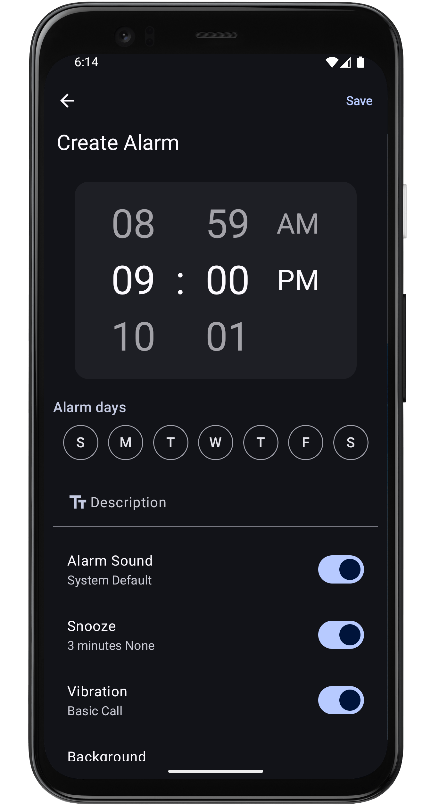

# ClockApp

An android clock app, as it says its a all purpose clock app mostly found in your phone.

## About

This application being developed to offer users a reliable and customizable clock experience.
The initial focus has been on creating a robust alarm feature, with plans to expand its capabilities
to include other essential clock functions in the future.
The goal is to provide a user-friendly interface with options for personalization.

## Features

Currently, the app includes the following alarm features:

- Create and Manage Alarms: Set up various alarms with different times, repeat options (daily,
  weekly, specific days), and customizable labels.
- Customizable Alarm Sounds: Choose from a selection of default alarm tones or use device audio
  files,( they should be of ringtone type).
- Customizable Alarm Backgrounds: Personalize the alarm screen with preset images or images from
  your device's storage
- Heads-up Notifications: Receive timely notifications before your alarms go off.
- Full-Screen Alarm Display: A dedicated screen appears when an alarm is triggered, ensuring you
  don't miss it.

## Screenshots

These are some of the screenshots for the alarms

   
   
   
   

## Permissions

The permission required by this app are:

- **Schedule Exact Alarms (required)** :This permission is necessary to ensure that your set alarms
  trigger precisely at the scheduled time. Without this, alarms might not function reliably.
- **Notification (required)** :Notification permissions are essential for displaying a heads-up
  notification before an alarm sounds and for showing the full alarm screen when an alarm goes off.
- **Storage (optional)** : This app can use images and audio from current device to customize the
  alarm experience.

## Contributing

Yes the app isn't complete yet and will be worked on in the future, if you want to contribute to any
feature of the app you are always welcome. It's advised to open an issue first to discuss about the
feature.

- Fork the repository.
- Create your feature branch (git checkout -b feature/your_feature).
- Commit your changes (git commit -am 'Add some feature').
- Push to the branch (git push origin feature/YourFeature).
- Create a new Pull Request.

## Feedback and support

If you encounter any bugs, issues, or have suggestions for improvements, please don't hesitate to
open an issue on the repository. Your feedback is valuable in making this app better.

## Whats next

Its just the alarm feature completed, other features like `timer` ,`stopwatch` and others are still
remain. And would be slowly added into the app. While the development pace might be slower than
initially anticipated, the goal is to eventually complete all planned features and create a
comprehensive clock application.
